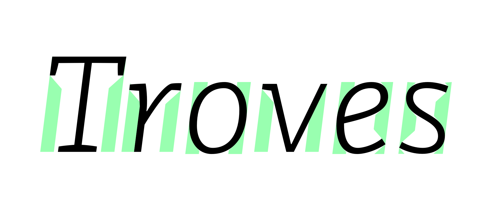

# ShowHTLetterspacerAreas
This plugin for Glyphs draws the polygons calculated by HT Letterspacer in the edit view. Requires [HTLS Manager](https://github.com/eweracs/HTLSManager) to be installed.

